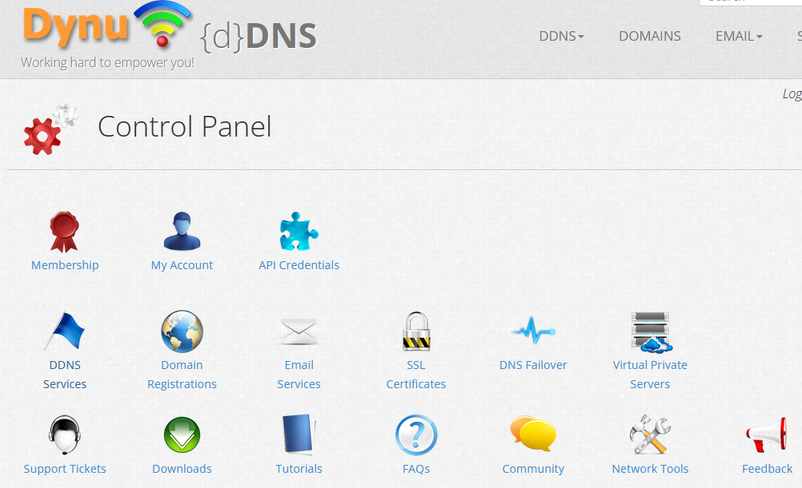
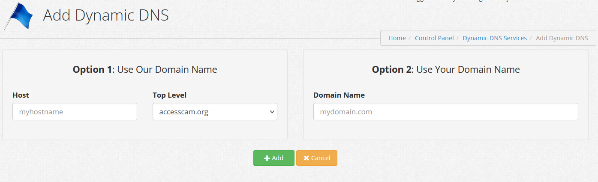
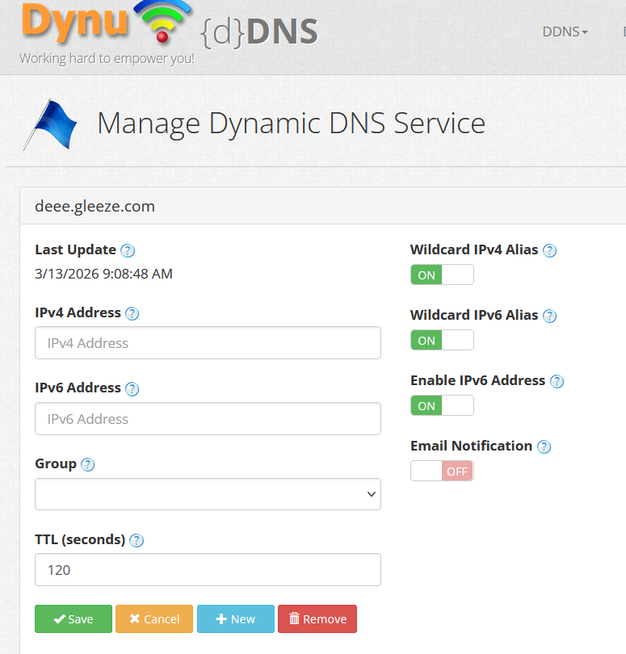

# 3. DDNS

Alright, time to start building. Our first mission is to create a Dynamic DNS to update my public IP without me having to do anything. A great thing about DDNS is that my router supports DDNS updating, in which I will configure later on. 

To register a DDNS, I need to first find a provider that allows me to create a domainname and create a DDNS service with my IP. The provider of my choice is Dynu, a free DDNS provider that does not require a lot of setup and runs 24/7 even when I am away for a long time. Just by creating my account, I get prompted to this dashboard: 

 

Overwhelming with options, I only need "DDNS Services". By pressing the option, it presents nothing in the table since I have no DDNS set up. By adding a new one, I will be able to add a a new domainname. Dynu only allows domainnames connected to a subdomain for free users. In this case, it presents no issues to the project but I will need to note down the domainname for router configurations later on.

After entering my desired domainname, the DDNS service will create a new domain assigned with my IP address automatically, which saves a lot of time. After pressing save, the DDNS will be configured and the Dynu part of this project will be done.

