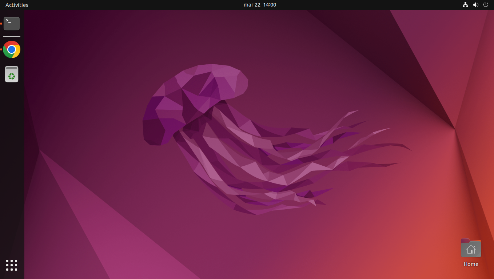

# 3. DDNS

Alright, time to start building. Our first mission is to create a Dynamic DNS to update my public IP without me having to do anything. A great thing about DDNS is that my router supports DDNS updating, in which I will configure later on. 

To register a DDNS, I need to first find a provider that allows me to create a domainname and create a DDNS service with my IP. The provider of my choice is Dynu, a free DDNS provider that does not require a lot of setup and runs 24/7 even when I am away for a long time. Just by creating my account, I get prompted to this dashboard:  
