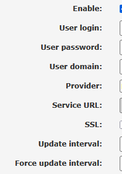

# 6. Router Configuration

Now we are the last part of this project before testing, it is time to configure our home router. I will split this part in two different parts, since we are only configuring two different settings on the router.

# DDNS
The DDNS we have created will need to get updates if our WAN IP changes, which is where the router comes in play. As previously mentioned, our router allows dyanmic updates on our IP info through DDNS. My only objective to fix this setting is to provide all the info the router needs:

I will simply provide the details on each part and explain what it means:

**Enable**: *Used to either turn on or off the DDNS updater, we need it on.*

**User login**: *Provide your username that we have registered the domain with. Provided my username from Dynu.*

**User password**: *Provide your password we have registered the domain with. Provided my password from Dynu.*

**User domain**: *The domain that we have created through a DDNS provider. Our DDNS from part 3 was provided.*

**Provider**: *The DDNS provider. Dynu was selected.*

**Service URL**: *The providers website, no need to write any info.*

**SSL**: *Used to allow secure authentication, not enabled for this project, since it would require more time and money.*

**Update interval**: *Sends IP address updates to DDNS in minutes, I've changed it to 10 min, as it is more appropriate.*

**Force update interval**: *Almost the same as previous setting, but forces a checkup if nothing has changed. I've set this to 40 min.*

By saving and applying all my settings, the DDNS is officially configured on my router!

# Port Forwarding

